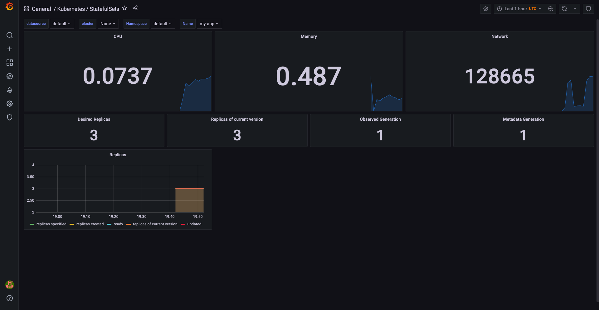
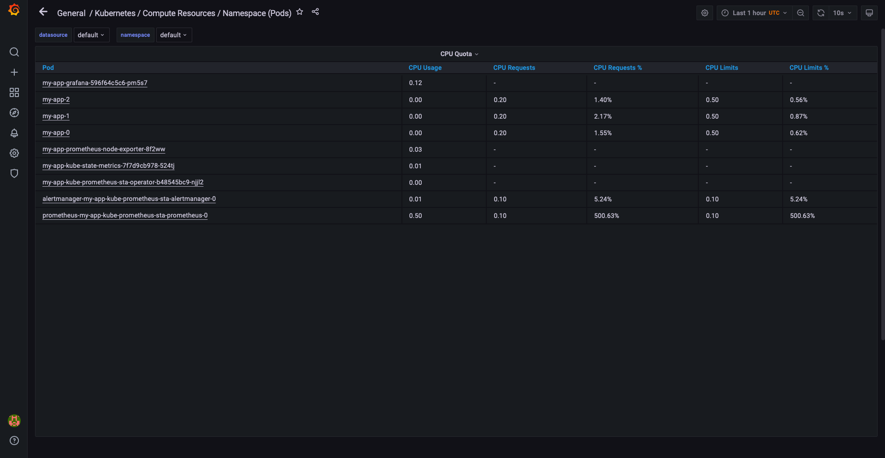
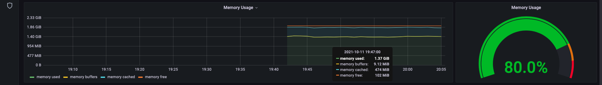
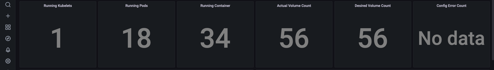
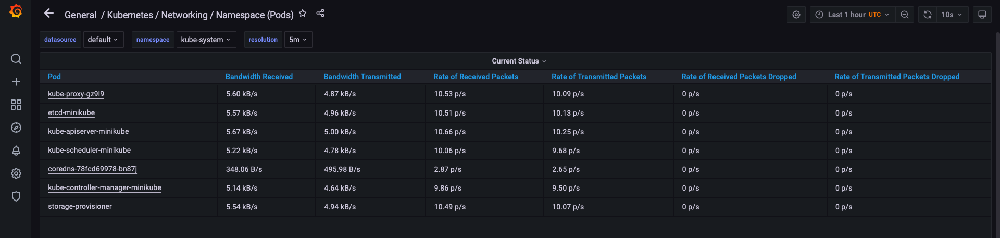
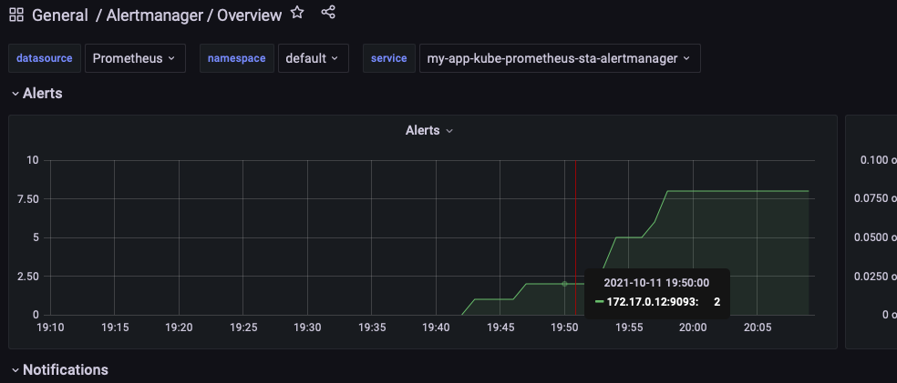

# Kube Prometheus Stack

## Prometheus Operator
Prometheus Operator simplifies the configuration of Prometheus. It allows to create and manage Prometheus, manage components in the stack, configure Prometheus versions, etc.

## Prometheus
Prometheus is needed for monitoring and altering systems, including:
- Keep metric data in time series
- Query of stored data using PromQL
- Visualize data in multiple ways.<br/>

## Highly available Alertmanager

Processes alerts of Prometheus. Eliminated duplicates, sends notifications

## Prometheus node-exporter
collect OS and hardware related metrics about nodes.

## Prometheus Adapter for Kubernetes Metrics
We need it to convert metrics for resources, API, etc. from Kubernetes to Prometheus

## kube-state-metrics
Service that listens to the Kubernetes API for generating metrics about the states of the objects.

## Grafana
A versatile dashboard for metrics of Prometheus.

# Provide the output of the kubectl get po,sts,svc,pvc,cm command in the report.

kubectl get po,sts,svc,pvc,cm This command recieves info about different k8s objects.

po: pods <br/>
sts: statefulset <br/>
svc: service <br/>
pvc: persistentvolumeclaim <br/>
cm: configmap <br/>


```
kubectl get po,sts,svc,pvc,cm
NAME                                                         READY   STATUS              RESTARTS   AGE
pod/alertmanager-my-app-kube-prometheus-sta-alertmanager-0   0/2     ContainerCreating   0          8s
pod/my-app-0                                                 0/1     Running             0          18s
pod/my-app-1                                                 0/1     Running             0          18s
pod/my-app-2                                                 0/1     Running             0          17s
pod/my-app-grafana-596f64c5c6-pm5s7                          0/2     Init:0/1            0          18s
pod/my-app-kube-prometheus-sta-operator-b48545bc9-njjl2      1/1     Running             0          18s
pod/my-app-kube-state-metrics-7f7d9cb978-524tj               1/1     Running             0          18s
pod/my-app-prometheus-node-exporter-8f2ww                    1/1     Running             0          18s
pod/prometheus-my-app-kube-prometheus-sta-prometheus-0       0/2     Init:0/1            0          1s

NAME                                                                    READY   AGE
statefulset.apps/alertmanager-my-app-kube-prometheus-sta-alertmanager   0/1     9s
statefulset.apps/my-app                                                 0/3     19s
statefulset.apps/prometheus-my-app-kube-prometheus-sta-prometheus       0/1     2s

NAME                                              TYPE           CLUSTER-IP       EXTERNAL-IP   PORT(S)                      AGE
service/alertmanager-operated                     ClusterIP      None             <none>        9093/TCP,9094/TCP,9094/UDP   9s
service/kubernetes                                ClusterIP      10.96.0.1        <none>        443/TCP                      7d1h
service/my-app                                    LoadBalancer   10.96.182.189    <pending>     5000:32723/TCP               19s
service/my-app-grafana                            ClusterIP      10.100.255.117   <none>        80/TCP                       19s
service/my-app-kube-prometheus-sta-alertmanager   ClusterIP      10.99.106.182    <none>        9093/TCP                     19s
service/my-app-kube-prometheus-sta-operator       ClusterIP      10.106.34.171    <none>        443/TCP                      19s
service/my-app-kube-prometheus-sta-prometheus     ClusterIP      10.107.238.146   <none>        9090/TCP                     19s
service/my-app-kube-state-metrics                 ClusterIP      10.101.251.109   <none>        8080/TCP                     19s
service/my-app-prometheus-node-exporter           ClusterIP      10.110.150.76    <none>        9100/TCP                     19s
service/prometheus-operated                       ClusterIP      None             <none>        9090/TCP                     2s

NAME                                        STATUS   VOLUME                                     CAPACITY   ACCESS MODES   STORAGECLASS   AGE
persistentvolumeclaim/json-mount-my-app-0   Bound    pvc-42c9c00d-ae91-4557-a652-1280fee03236   256M       RWO            standard       7d
persistentvolumeclaim/json-mount-my-app-1   Bound    pvc-cd5b7323-7f2f-4d42-a298-34de15082536   256M       RWO            standard       7d
persistentvolumeclaim/json-mount-my-app-2   Bound    pvc-ec7388b3-cbfa-4d32-80dd-4f1ac5e652fb   256M       RWO            standard       7d

NAME                                                                     DATA   AGE
configmap/cfmap                                                          1      20s
configmap/kube-root-ca.crt                                               1      21d
configmap/my-app-grafana                                                 1      20s
configmap/my-app-grafana-config-dashboards                               1      20s
configmap/my-app-grafana-test                                            1      20s
configmap/my-app-kube-prometheus-sta-alertmanager-overview               1      20s
configmap/my-app-kube-prometheus-sta-apiserver                           1      20s
configmap/my-app-kube-prometheus-sta-cluster-total                       1      20s
configmap/my-app-kube-prometheus-sta-controller-manager                  1      20s
configmap/my-app-kube-prometheus-sta-etcd                                1      20s
configmap/my-app-kube-prometheus-sta-grafana-datasource                  1      20s
configmap/my-app-kube-prometheus-sta-k8s-coredns                         1      20s
configmap/my-app-kube-prometheus-sta-k8s-resources-cluster               1      20s
configmap/my-app-kube-prometheus-sta-k8s-resources-namespace             1      20s
configmap/my-app-kube-prometheus-sta-k8s-resources-node                  1      20s
configmap/my-app-kube-prometheus-sta-k8s-resources-pod                   1      20s
configmap/my-app-kube-prometheus-sta-k8s-resources-workload              1      20s
configmap/my-app-kube-prometheus-sta-k8s-resources-workloads-namespace   1      20s
configmap/my-app-kube-prometheus-sta-kubelet                             1      20s
configmap/my-app-kube-prometheus-sta-namespace-by-pod                    1      20s
configmap/my-app-kube-prometheus-sta-namespace-by-workload               1      20s
configmap/my-app-kube-prometheus-sta-node-cluster-rsrc-use               1      20s
configmap/my-app-kube-prometheus-sta-node-rsrc-use                       1      20s
configmap/my-app-kube-prometheus-sta-nodes                               1      20s
configmap/my-app-kube-prometheus-sta-persistentvolumesusage              1      20s
configmap/my-app-kube-prometheus-sta-pod-total                           1      20s
configmap/my-app-kube-prometheus-sta-prometheus                          1      20s
configmap/my-app-kube-prometheus-sta-proxy                               1      20s
configmap/my-app-kube-prometheus-sta-scheduler                           1      20s
configmap/my-app-kube-prometheus-sta-statefulset                         1      20s
configmap/my-app-kube-prometheus-sta-workload-total                      1      20s
configmap/prometheus-my-app-kube-prometheus-sta-prometheus-rulefiles-0   28     4s
```

## Use the minikube service monitoring-grafana command to access Grafana. Click on the Search dashboard button to see all already prepared for you dashboards. Use existing dashboards to find the information about your cluster

1. Check how much CPU and Memory your StatefulSet is consuming.

CPU ~ 2%
Memory ~ 0.487GB




2. Check which Pod is using CPU more than others and which is less in the default namespace.

prometheus-my-app-kube-prometheus-sta-prometheus-0 uses more CPU than others 

Not consuming CPU pods:
my-app-prometheus-node-exporter-8f2ww
my-app-kube-state-metrics-7f7d9cb978-524tj
my-app-kube-prometheus-sta-operator-b48545bc9-njjl2	
alertmanager-my-app-kube-prometheus-sta-alertmanager-0


3. Check how much memory is used on your node, in % and mb.



4. Check how many pods and containers actually ran by the Kubelet service.



5. Check which Pod is using network more than others and which is less in the default namespace.



6. Check how many alerts you have.




## Provide a proof of your success, for example kubectl exec pod/demo-0 -- cat /wget/test.html
```
kamil@MacBook-Pro-Kamil k8s % kubectl exec pod/my-app-0 -- cat /wget/test.html
Defaulted container "my-app" out of: my-app, install (init)
<html><head></head><body><header>
<title>http://info.cern.ch</title>
</header>

<h1>http://info.cern.ch - home of the first website</h1>
<p>From here you can:</p>
<ul>
<li><a href="http://info.cern.ch/hypertext/WWW/TheProject.html">Browse the first website</a></li>
<li><a href="http://line-mode.cern.ch/www/hypertext/WWW/TheProject.html">Browse the first website using the line-mode browser simulator</a></li>
<li><a href="http://home.web.cern.ch/topics/birth-web">Learn about the birth of the web</a></li>
<li><a href="http://home.web.cern.ch/about">Learn about CERN, the physics laboratory where the web was born</a></li>
</ul>
</body></html>
```